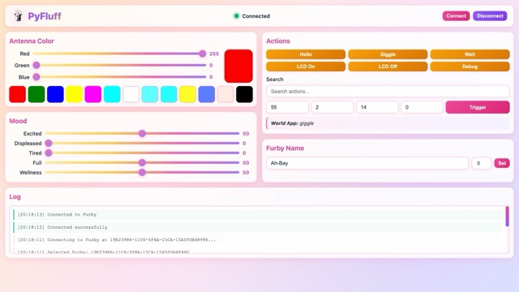

# PyFluff - Modern Python Controller for Furby Connect

A modern, Python 3.11+ implementation of Furby Connect Bluetooth LE control, designed for Raspberry Pi OS (Bookworm) and other Linux systems.


## About

PyFluff is a complete rewrite of the original [bluefluff](https://github.com/Jeija/bluefluff) project in modern Python. It provides full control over the (now unsupported) Furby Connect toys via Bluetooth Low Energy (BLE), allowing you to:

* Control Furby's actions, antenna color, and LCD backlight
* Adjust Furby's emotions (hungriness, tiredness, wellness, etc.)
* Monitor sensor states (antenna joystick, tickle/pet sensors, accelerometer)
* Update Furby with official or custom DLC files
* Access debug menus on Furby's LCD eyes
* Build custom applications and automations

> [!WARNING]
> I used GitHub Copilot to port the Bluefluff project over to Python for me
> which it did in a one-shot prompt. However that does mean there is code
> here which I haven't fully tested yet. I'm publishing now while I work on
> this in the open, but any issues you find is not the fault of Copilot
> or indeed the fault of the incredible work of Jeija and the [Bluefluff](https://github.com/Jeija/bluefluff) community.
> It's entirely my fault for not testing that part of the code properly yet.
> If you find an issue, please do let me know. 

## Features

* **Modern Python 3.11+**: Uses type hints, async/await, and modern Python patterns
* **Bleak BLE Stack**: Well-maintained, cross-platform BLE library
* **FastAPI Web Server**: Modern async web framework with automatic OpenAPI documentation
* **WebSocket Support**: Real-time sensor data streaming
* **Async/Await**: Non-blocking operations throughout
* **Structured Logging**: JSON-formatted logs for easy parsing
* **Type Safety**: Full type hints for better IDE support and fewer bugs

## Requirements

* Python 3.11 or later
* **Production**: Raspberry Pi OS (Bookworm) or other Linux distribution
* **Development**: macOS 10.15+ or Linux with Bluetooth support
* Bluetooth 4.0+ adapter (built-in on Raspberry Pi 3/4/5 and modern Macs)

## Installation

### On Raspberry Pi OS (Bookworm)

```bash
# Clone the repository
git clone https://github.com/yourusername/PyFluff.git
cd PyFluff

# Create virtual environment
python3 -m venv venv
source venv/bin/activate

# Install dependencies
pip install -r requirements.txt
```

### On macOS (for Development)

```bash
# Clone the repository
git clone https://github.com/yourusername/PyFluff.git
cd PyFluff

# Create virtual environment (using system Python or pyenv)
python3 -m venv venv
source venv/bin/activate

# Install dependencies
pip install -r requirements.txt
```

### System Setup

#### Linux (Raspberry Pi OS)
Ensure Bluetooth is enabled:

```bash
sudo systemctl enable bluetooth
sudo systemctl start bluetooth
```

#### macOS
Bluetooth should work out of the box. Ensure Bluetooth is enabled in System Preferences and that your terminal (or your IDE) has Bluetooth permissions when prompted.

## Usage

### Starting the Server

```bash
# Activate virtual environment
source venv/bin/activate

# Start PyFluff server
python -m pyfluff.server
```

The server will:
1. Scan for Furby Connect devices
2. Automatically connect when found
3. Start HTTP/WebSocket server on port 8080

### Web Interface

Open your browser to `http://localhost:8080` (or your Raspberry Pi's IP address) to access the interactive control panel.



### API Documentation

Interactive API documentation is available at:
* Swagger UI: `http://localhost:8080/docs`
* ReDoc: `http://localhost:8080/redoc`

#### Action Sequences

You can send multiple actions to Furby that execute one after another:

```bash
# Using curl to send a sequence
curl -X POST http://localhost:8080/actions/sequence \
  -H "Content-Type: application/json" \
  -d '{
    "actions": [
      {"input": 71, "index": 0, "subindex": 0, "specific": 0},
      {"input": 71, "index": 0, "subindex": 0, "specific": 1},
      {"input": 71, "index": 0, "subindex": 0, "specific": 2}
    ],
    "delay": 1.5
  }'
```

Or use the Python example:
```bash
python examples/action_sequence.py
```

### Command Line Interface

```bash
# Scan for Furby devices
python -m pyfluff.cli scan

# Scan for ALL BLE devices (useful if Furbies are in F2F mode)
python -m pyfluff.cli scan --all

# Test connection to a specific Furby by MAC address
python -m pyfluff.cli connect AA:BB:CC:DD:EE:FF

# Set antenna color to red
python -m pyfluff.cli antenna --red 255 --green 0 --blue 0

# Set antenna color for a specific Furby (by MAC address)
python -m pyfluff.cli antenna --red 255 --green 0 --blue 0 --address AA:BB:CC:DD:EE:FF

# Trigger a specific action
python -m pyfluff.cli action --input 1 --index 0 --subindex 0 --specific 0

# Monitor sensors in real-time
python -m pyfluff.cli monitor

# Get device information
python -m pyfluff.cli info

# Control LCD backlight
python -m pyfluff.cli lcd true

# Cycle debug menu
python -m pyfluff.cli debug

# Upload DLC file
python -m pyfluff.cli upload-dlc custom.dlc --slot 2

# Load DLC from slot
python -m pyfluff.cli load-dlc 2

# Activate loaded DLC
python -m pyfluff.cli activate-dlc

# List all known Furbies from cache
python -m pyfluff.cli list-known

# Remove a Furby from cache
python -m pyfluff.cli remove-known AA:BB:CC:DD:EE:FF

# Clear all known Furbies from cache
python -m pyfluff.cli clear-known --force
```

### Known Furbies Cache

PyFluff automatically maintains a cache of discovered Furbies in `known_furbies.json`. This cache stores:
- **MAC addresses** of discovered Furbies
- **Last known names** and name IDs (when set)
- **Last seen timestamps**
- **Firmware versions** (when available)
- **BLE device names**

The cache is automatically updated when:
- Furbies are discovered during scanning
- Successful connections are established
- Names are changed via the API or CLI

This makes it easy to reconnect to Furbies even when they're in F2F mode and not advertising.

**Cache file format (`known_furbies.json`):**
```json
{
  "furbies": {
    "AA:BB:CC:DD:EE:FF": {
      "address": "AA:BB:CC:DD:EE:FF",
      "name": "Name ID 42",
      "name_id": 42,
      "device_name": "Furby",
      "last_seen": 1729353600.0,
      "firmware_revision": "1.0.0"
    }
  }
}
```

### Connecting to Furbies in F2F (Furby-to-Furby) Mode

When Furbies are communicating with each other (F2F mode), they may stop advertising their BLE presence, making them invisible to standard discovery scans. Here's how to connect to them:

#### Option 1: Connect by MAC Address (Recommended)

If you know your Furby's MAC address from a previous connection:

**CLI:**
```bash
python -m pyfluff.cli connect AA:BB:CC:DD:EE:FF
```

**Python API:**
```python
furby = FurbyConnect()
await furby.connect(address="AA:BB:CC:DD:EE:FF")
```

**Web Interface:**
Enter the MAC address in the input field next to the "Connect" button.

#### Option 2: Find MAC Address

Scan for all BLE devices while your Furby is **not** in F2F mode:
```bash
python -m pyfluff.cli scan
# Note down the MAC address
```

#### Option 3: Wake from F2F Mode

Touch or shake the Furby to wake it from F2F communication, then scan normally.

#### Understanding F2F Mode

Two mysterious BLE characteristics (`dab91440` and `dab91441`) are suspected to handle Furby-to-Furby communication, allowing them to:
- Exchange names and personal information
- Synchronize actions like singing together
- Coordinate behaviors

**Note:** These F2F characteristics are not yet reverse-engineered or implemented in PyFluff. Connecting while Furbies are actively communicating may interrupt their interaction.

### Python API

```python
import asyncio
from pyfluff.furby import FurbyConnect

async def main():
    furby = FurbyConnect()
    
    # Option 1: Auto-discover and connect
    await furby.connect()
    
    # Option 2: Connect by MAC address (for F2F mode)
    await furby.connect(address="AA:BB:CC:DD:EE:FF")
    
    # Set antenna color to red
    await furby.set_antenna_color(255, 0, 0)
    
    # Trigger an action
    await furby.trigger_action(input=55, index=2, subindex=14, specific=0)
    
    # Monitor sensors
    async for sensor_data in furby.sensor_stream():
        print(sensor_data)
    
    await furby.disconnect()

asyncio.run(main())
```

## Project Structure

```
PyFluff/
├── pyfluff/
│   ├── __init__.py
│   ├── furby.py          # Core Furby BLE communication
│   ├── protocol.py       # BLE protocol definitions
│   ├── commands.py       # Command handlers
│   ├── dlc.py           # DLC file handling
│   ├── server.py        # FastAPI web server
│   ├── cli.py           # Command-line interface
│   └── models.py        # Data models
├── web/
│   ├── index.html       # Web control interface
│   ├── style.css
│   └── app.js
├── tests/
│   ├── test_furby.py
│   ├── test_protocol.py
│   └── test_commands.py
├── examples/
│   ├── basic_control.py
│   ├── mood_monitor.py
│   └── custom_dlc.py
├── requirements.txt
├── pyproject.toml
├── README.md
└── LICENSE

```

## Key Changes from Bluefluff

1. **Python Based**: Built for Python 3 with async. 
2. **Modern BLE Stack**: Uses [Bleak](https://github.com/hbldh/bleak)
3. **Type Safety**: Full type hints with Pydantic models
4. **Web RPC**: Kept a RESTful HTTP API with WebSocket support
5. **Auto Documentation**: OpenAPI/Swagger docs
6. **Cross-Platform**: Works on Linux, macOS, and Windows (with proper BLE support)
7. **Testing**: pytest based test suite
8. **Logging**: Structured JSON logging

## Development

### Setup Development Environment

#### macOS
```bash
# Recommended: Use pyenv for Python version management
brew install pyenv
pyenv install 3.11.6
pyenv local 3.11.6

# Clone and setup project
git clone https://github.com/yourusername/PyFluff.git
cd PyFluff
python -m venv venv
source venv/bin/activate

# Install development dependencies
pip install -r requirements-dev.txt
```

#### Linux (Raspberry Pi/Ubuntu)
```bash
# Ensure Python 3.11+ is available
sudo apt update
sudo apt install python3.11 python3.11-venv python3.11-dev

# Clone and setup project
git clone https://github.com/yourusername/PyFluff.git
cd PyFluff
python3.11 -m venv venv
source venv/bin/activate

# Install development dependencies
pip install -r requirements-dev.txt
```

### Development Commands

```bash
# Run tests
pytest

# Run with auto-reload (development server)
uvicorn pyfluff.server:app --reload --host 0.0.0.0 --port 8080

# Type checking
mypy pyfluff/

# Linting and formatting
ruff check pyfluff/
ruff format pyfluff/

# Run specific test file
pytest tests/test_protocol.py -v
```

### Platform Notes

#### macOS Development
- BLE works natively through Core Bluetooth
- Great for development and testing protocol logic
- Can connect to real Furby devices for testing
- VS Code with Python extension and GitHub Copilot recommended

#### Raspberry Pi Deployment
- Production target platform
- Test thoroughly on actual Pi hardware. Mostly tested on Pi 4B and 5B.
- Consider using systemd service for headless deployment
  
## Documentation

Thanks to the Bluefluff community, comprehensive protocol documentation is available in the [`docs/`](docs/) directory:

* **[Action Reference](docs/actions.md)** - Understanding Furby's action system
  * [Complete Action List](docs/actionlist.md) - All ~1000 actions with transcriptions
  * [Furby Names](docs/names.md) - All 129 possible Furby names
* **[Protocol Documentation](docs/)** - Complete BLE protocol reference
  * [Bluetooth GATT Structure](docs/bluetooth.md) - Service and characteristic UUIDs
  * [GeneralPlus Commands](docs/generalplus.md) - Main processor command reference
  * [Nordic Commands](docs/nordic.md) - Nordic SoC commands for DLC transfer
* **[DLC Files](docs/dlcformat.md)** - Custom content creation
  * [Flashing DLC Files](docs/flashdlc.md) - How to upload custom content

All documentation is derived from the original bluefluff project's research.

## Acknowledgments

This project is based on the excellent reverse engineering work by [Jeija](https://github.com/Jeija) in the original [bluefluff](https://github.com/Jeija/bluefluff) project. All protocol documentation and understanding of Furby Connect's internals comes from that research.

## Further Reading
While researching this project, As well as BlueFluff, I found the following resources that you might also want to check out:
- [Python tools for handling Furby Connect DLC files](https://github.com/ctxis/furby)
- [FurBLE - Furby Web Bluetooth for Android](https://github.com/pdjstone/furby-web-bluetooth)

## Disclaimer

**This information is for educational purposes only.** By using this software, you agree to solely take risks for damaging your hardware. You may brick your Furby when interfacing with it in unwarranted ways and you will almost certainly void any warranty you might have.

Furby is a trademark of Hasbro. This project is not affiliated with Hasbro in
ANY WAY. It is purely for educational purposes and to allow technically minded owners of Furby Connect edition toys to be able to control their devices over Bluetooth now that the manufacturer has removed support for the associated Bluetooth control application. The Furby Connect edition toy and associated sofwtare are no longer supported by Hasbro so please don't contact them for support with this project.  All rights reserved to their respective owners.

The project ONLY works with a Furby connection edition toy, and not the current retail Furby's available today.  You'll need to own one of the older toys to be able to experiment (it's the one with LCD eyes) and sleeping mask.

All reverse engineering of the Furby Connect edition Bluetooth protocol was done by the Bluefluff community. Please see the original Bluefluff project for more information https://github.com/Jeija/bluefluff on their amazing work.

This project stands entirely on the shoulders of those diminutive giants.

## License

MIT License - see the [LICENSE](LICENSE) file for details
