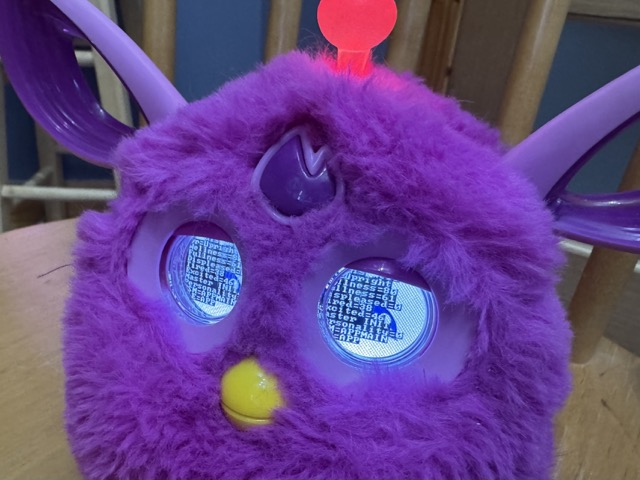

# PyFluff - Modern Python Controller for Furby Connect

A modern, Python 3.11+ implementation of Furby Connect Bluetooth LE control, designed for Raspberry Pi OS (Bookworm) and other Linux systems.



## About

PyFluff is a complete rewrite of the original [bluefluff](https://github.com/Jeija/bluefluff) project in modern Python. It provides full control over the (now unsupported) Furby Connect toys via Bluetooth Low Energy (BLE), allowing you to:

* Control Furby's actions, antenna color, and LCD backlight
* Adjust Furby's emotions (hungriness, tiredness, wellness, etc.)
* Monitor sensor states (antenna joystick, tickle/pet sensors, accelerometer)
* Update Furby with official or custom DLC files
* Access debug menus on Furby's LCD eyes
* Build custom applications and automations

> [!WARNING] Thar be (Fluffy) Dragons
> I used GitHub Copilot to port the Bluefluff project over to Python for me
> which it did in a one-shot prompt. However that does mean there is code
> here which I haven't fully tested yet. I'm publishing now while I work on
> this in the open, but any issues you find is not the fault of Copilot
> or indeed the fault of the incredible work of Jeija and the [Bluefluff](https://github.com/Jeija/bluefluff) community.
> It's entirely my fault for not testing that part of the code properly yet.
> If you find an issue, please do let me know. 

## Features

* **Modern Python 3.11+**: Uses type hints, async/await, and modern Python patterns
* **Bleak BLE Stack**: Well-maintained, cross-platform BLE library
* **FastAPI Web Server**: Modern async web framework with automatic OpenAPI documentation
* **WebSocket Support**: Real-time sensor data streaming
* **Async/Await**: Non-blocking operations throughout
* **Structured Logging**: JSON-formatted logs for easy parsing
* **Type Safety**: Full type hints for better IDE support and fewer bugs

## Requirements

* Python 3.11 or later
* **Production**: Raspberry Pi OS (Bookworm) or other Linux distribution
* **Development**: macOS 10.15+ or Linux with Bluetooth support
* Bluetooth 4.0+ adapter (built-in on Raspberry Pi 3/4/5 and modern Macs)

## Installation

### On Raspberry Pi OS (Bookworm)

```bash
# Clone the repository
git clone https://github.com/yourusername/PyFluff.git
cd PyFluff

# Create virtual environment
python3 -m venv venv
source venv/bin/activate

# Install dependencies
pip install -r requirements.txt
```

### On macOS (for Development)

```bash
# Clone the repository
git clone https://github.com/yourusername/PyFluff.git
cd PyFluff

# Create virtual environment (using system Python or pyenv)
python3 -m venv venv
source venv/bin/activate

# Install dependencies
pip install -r requirements.txt
```

### System Setup

#### Linux (Raspberry Pi OS)
Ensure Bluetooth is enabled:

```bash
sudo systemctl enable bluetooth
sudo systemctl start bluetooth
```

#### macOS
Bluetooth should work out of the box. Ensure Bluetooth is enabled in System Preferences and that your terminal (or your IDE) has Bluetooth permissions when prompted.

## Usage

### Starting the Server

```bash
# Activate virtual environment
source venv/bin/activate

# Start PyFluff server
python -m pyfluff.server
```

The server will:
1. Scan for Furby Connect devices
2. Automatically connect when found
3. Start HTTP/WebSocket server on port 8080

### Web Interface

Open your browser to `http://localhost:8080` (or your Raspberry Pi's IP address) to access the interactive control panel.

### API Documentation

Interactive API documentation is available at:
* Swagger UI: `http://localhost:8080/docs`
* ReDoc: `http://localhost:8080/redoc`

### Command Line Interface

```bash
# Scan for Furby devices
python -m pyfluff.cli scan

# Send a command
python -m pyfluff.cli command --action antenna --red 255 --green 0 --blue 0

# Monitor sensors
python -m pyfluff.cli monitor
```

### Python API

```python
import asyncio
from pyfluff.furby import FurbyConnect

async def main():
    furby = FurbyConnect()
    await furby.connect()
    
    # Set antenna color to red
    await furby.set_antenna_color(255, 0, 0)
    
    # Trigger an action
    await furby.trigger_action(input=55, index=2, subindex=14, specific=0)
    
    # Monitor sensors
    async for sensor_data in furby.sensor_stream():
        print(sensor_data)
    
    await furby.disconnect()

asyncio.run(main())
```

## Project Structure

```
PyFluff/
├── pyfluff/
│   ├── __init__.py
│   ├── furby.py          # Core Furby BLE communication
│   ├── protocol.py       # BLE protocol definitions
│   ├── commands.py       # Command handlers
│   ├── dlc.py           # DLC file handling
│   ├── server.py        # FastAPI web server
│   ├── cli.py           # Command-line interface
│   └── models.py        # Data models
├── web/
│   ├── index.html       # Web control interface
│   ├── style.css
│   └── app.js
├── tests/
│   ├── test_furby.py
│   ├── test_protocol.py
│   └── test_commands.py
├── examples/
│   ├── basic_control.py
│   ├── mood_monitor.py
│   └── custom_dlc.py
├── requirements.txt
├── pyproject.toml
├── README.md
└── LICENSE

```

## Key Improvements Over Original

1. **Modern BLE Stack**: Uses [Bleak](https://github.com/hbldh/bleak) instead of deprecated Noble
2. **Async/Await**: Non-blocking I/O throughout
3. **Type Safety**: Full type hints with Pydantic models
4. **Better API**: RESTful HTTP API with WebSocket support
5. **Auto Documentation**: OpenAPI/Swagger docs generated automatically
6. **Cross-Platform**: Works on Linux, macOS, and Windows (with proper BLE support)
7. **Testing**: Comprehensive test suite with pytest
8. **Logging**: Structured JSON logging for production use

## Development

### Setup Development Environment

#### macOS
```bash
# Recommended: Use pyenv for Python version management
brew install pyenv
pyenv install 3.11.6
pyenv local 3.11.6

# Clone and setup project
git clone https://github.com/yourusername/PyFluff.git
cd PyFluff
python -m venv venv
source venv/bin/activate

# Install development dependencies
pip install -r requirements-dev.txt
```

#### Linux (Raspberry Pi/Ubuntu)
```bash
# Ensure Python 3.11+ is available
sudo apt update
sudo apt install python3.11 python3.11-venv python3.11-dev

# Clone and setup project
git clone https://github.com/yourusername/PyFluff.git
cd PyFluff
python3.11 -m venv venv
source venv/bin/activate

# Install development dependencies
pip install -r requirements-dev.txt
```

### Development Commands

```bash
# Run tests
pytest

# Run with auto-reload (development server)
uvicorn pyfluff.server:app --reload --host 0.0.0.0 --port 8080

# Type checking
mypy pyfluff/

# Linting and formatting
ruff check pyfluff/
ruff format pyfluff/

# Run specific test file
pytest tests/test_protocol.py -v
```

### Platform Notes

#### macOS Development
- BLE works natively through Core Bluetooth
- Great for development and testing protocol logic
- Can connect to real Furby devices for testing
- VS Code with Python extension recommended

#### Raspberry Pi Deployment
- Production target platform
- Test thoroughly on actual Pi hardware
- Consider using systemd service for production deployment
- Monitor resource usage (CPU/memory) during BLE operations

## Documentation

Comprehensive protocol documentation is available in the [`docs/`](docs/) directory:

* **[Protocol Documentation](docs/)** - Complete BLE protocol reference
  * [Bluetooth GATT Structure](docs/bluetooth.md) - Service and characteristic UUIDs
  * [GeneralPlus Commands](docs/generalplus.md) - Main processor command reference
  * [Nordic Commands](docs/nordic.md) - Nordic SoC commands for DLC transfer
* **[Action Reference](docs/actions.md)** - Understanding Furby's action system
  * [Complete Action List](docs/actionlist.md) - All ~1000 actions with transcriptions
  * [Furby Names](docs/names.md) - All 129 possible Furby names
* **[DLC Files](docs/dlcformat.md)** - Custom content creation
  * [Flashing DLC Files](docs/flashdlc.md) - How to upload custom content
  * [App Update Mechanism](docs/connectworld.md) - How the official app works

All documentation is derived from the original bluefluff project's research.

## Acknowledgments

This project is based on the excellent reverse engineering work by [Jeija](https://github.com/Jeija) in the original [bluefluff](https://github.com/Jeija/bluefluff) project. All protocol documentation and understanding of Furby Connect's internals comes from that research.

## Disclaimer

**This information is for educational purposes only.** By using this software, you agree to solely take risks for damaging your hardware. You may brick your Furby when interfacing with it in unwarranted ways and you will almost certainly void your warranty.

## License

MIT License - see LICENSE file for details
